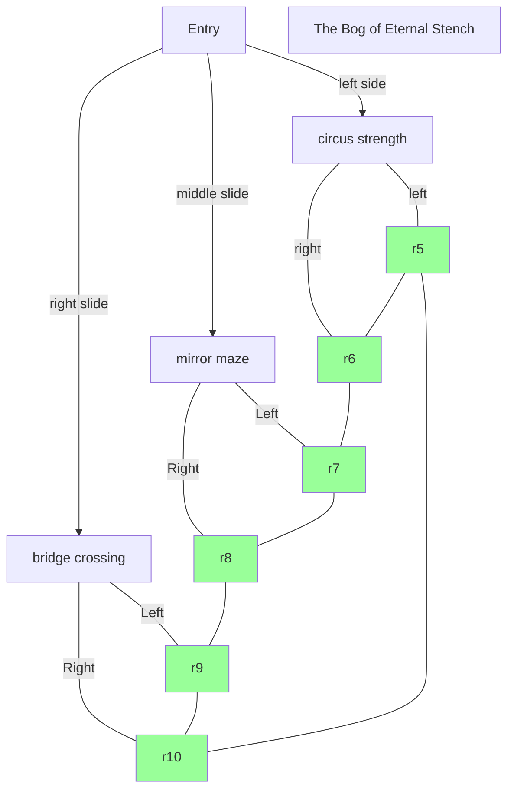

```mermaid
graph TB;

r1[Entry]
r1-- left side -->r2
r1-- middle slide -->r3
r1-- right slide -->r4
click r1 "https://github.com/mullinmax/Igors-challange/blob/master/igor-rooms.md#room-1"

r2[circus strength]
r2-- left ---r5
r2-- right ---r6
click r2 "https://github.com/mullinmax/Igors-challange/blob/master/igor-rooms.md#room-2"

r3[mirror maze]
r3-- Left ---r7
r3-- Right ---r8
click r3 "https://github.com/mullinmax/Igors-challange/blob/master/igor-rooms.md#room-3"

r4[bridge crossing]
r4-- Left ---r9
r4-- Right ---r10
click r4 "https://github.com/mullinmax/Igors-challange/blob/master/igor-rooms.md#room-4"

r5---r6
r6---r7
r7---r8
r8---r9
r9---r10
r10---r5

bog[The Bog of Eternal Stench]

classDef riddle fill:#9f9
class r5,r6,r7,r8,r9,r10 riddle;
```
