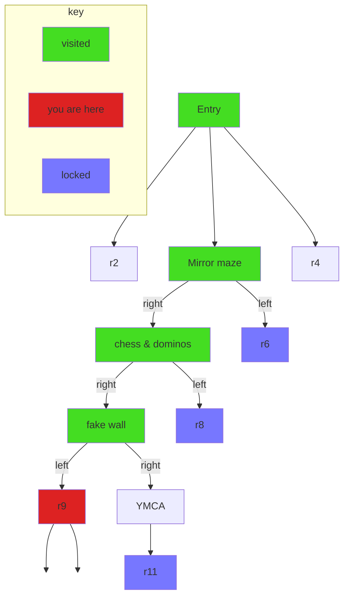

```mermaid
graph TB;
classDef hidden display:none;
classDef locked fill:#77F;
classDef here fill:#D22;
classDef visited fill:#4D2;

subgraph key
key1[visited]
key2[you are here]
key3[locked]
end

r1[Entry]
r2
r3[Mirror maze]
click r3 "https://github.com/mullinmax/Igors-challange/blob/master/igor-rooms.md#room-3"
r4

r1-->r2
r1-->r3
r1-->r4
r3-->|right|r5
r5[chess & dominos]
r7[fake wall]
r3-->|left|r6
r5-->|right|r7
r5-->|left|r8
r7-->|left|r9
r7-->|right|r10
r10-->r11
r10[YMCA]
r9-->r12
click r9 "https://github.com/mullinmax/Igors-challange/blob/master/igor-rooms.md#room-5"

r9-->r6_5
class r6_5 here;
class r6_5 hidden;
click r6_5 "https://github.com/mullinmax/Igors-challange/blob/master/igor-rooms.md#room-7"


class key1,r1,r3,r5,r7,r9,10 visited;
class key2,r9 here;
class key3,r8,r6,r11,r12 locked;
class r12 hidden;
```

rn
class rn visited;
class rn here;
class rn hidden;
click rn "https://github.com/mullinmax/Igors-challange/blob/master/igor-rooms.md#room-7"